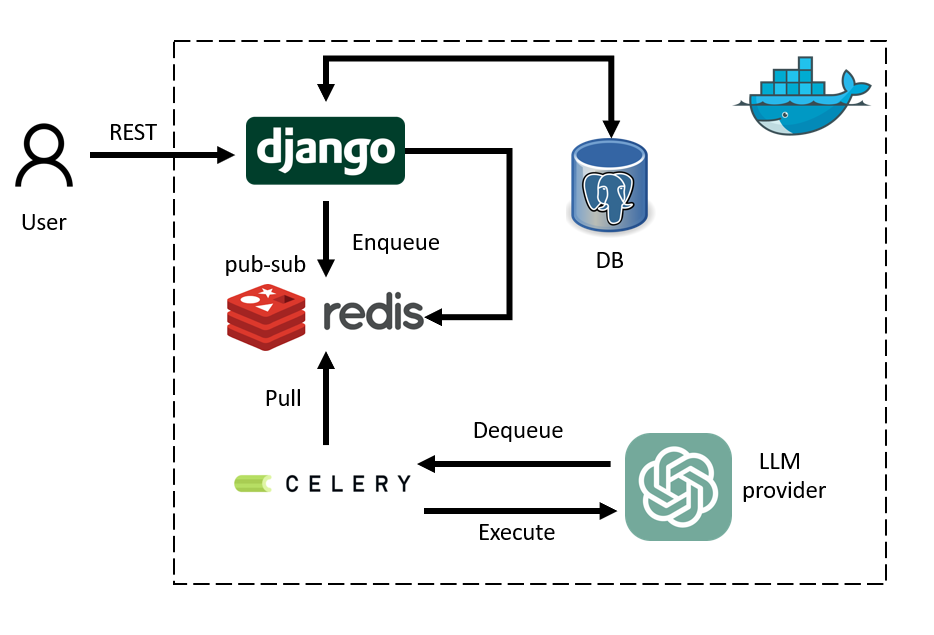

## Prerequisites

Before you begin, ensure you have the following installed on your machine:

- Python >= 3.10
- [Docker](https://docs.docker.com/get-docker/)
- [Docker Compose](https://docs.docker.com/compose/install/)
- Git (to clone the repository)

> **Tip:** You can verify your Docker installation by running:
> ```bash
> docker --version
> docker-compose --version
> ```

---

## 1. Clone the Repository

Start by cloning the project repository to your local machine:

```bash
git clone https://github.com/cohomologydreams/nordhealth.git
cd nordhealth
```

---

## 2. Environment Variables

Edit `provet/.env` and update the values as needed:

```dotenv
OPENAI_API_KEY = "your_openai_api_key_here"
```

---

## 3. Django Setup & Migrations

Before building the containers, install Python dependencies and prepare your Django app:

```bash
pip install -r requirements.txt
```

```bash
cd provet
python manage.py makemigrations autoconsul
python manage.py migrate
cd ..
```

---

## 4. Build and Run with Docker Compose

Use Docker Compose to build and start the application:

```bash
docker-compose up --build
```

- The `--build` flag ensures images are rebuilt.
- The first time may take a few minutes as Docker downloads and builds images.

---

## 5. Access the Application

Once the containers are up, open your browser and navigate to:

```
http://localhost:8000
```

You should see the application home page.


